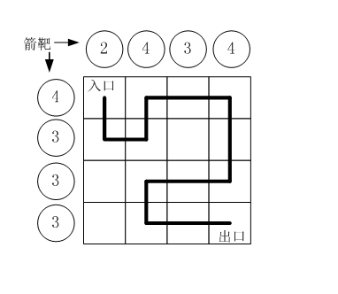

# 43686 - 路径之谜


## 题目

### 题目描述

小明冒充 $X$ 星球的骑士，进入了一个奇怪的城堡。城堡里边什么都没有，只有方形石头铺成的地面。假设城堡地面是 $n \times n$ 个方格。如下图所示。



按习俗，骑士要从西北角走到东南角。可以横向或纵向移动，但不能斜着走，也不能跳跃。每走到一个新方格，就要向**正北方和正西方**各射一箭。（城堡的西墙和北墙内各有 $n$ 个靶子）同一个方格只允许经过一次。但不必走完所有的方格。如果只给出靶子上箭的数目，你能推断出骑士的行走路线吗？有时是可以的，比如上图中的例子。

本题的要求就是已知箭靶数字，求骑士的行走路径（测试数据保证路径唯一）

### 输入描述

第一行一个整数 $N$ ($0 \leq N \leq 20$)，表示地面有 $N \times N$ 个方格。

第二行 $N$ 个整数，空格分开，表示北边的箭靶上的数字（自西向东）

第三行 $N$ 个整数，空格分开，表示西边的箭靶上的数字（自北向南）

### 输出描述

输出一行若干个整数，表示骑士路径。

为了方便表示，我们约定每个小格子用一个数字代表，从西北角开始编号 :
$0,1,2,3 \cdots$

比如，上图中的方块编号为：

$$
\begin{matrix}
0&1&2&3 \\
4&5&6&7 \\
8&9&10&11 \\
12&13&14&15
\end{matrix}
$$

### 输入输出样例

> 输入

```txt
4
2 4 3 4
4 3 3 3
```

> 输出

```txt
0 4 5 1 2 3 7 11 10 9 13 14 15
```

## 分析

此题为寻路问题，可采用**DFS**求解。

每次行走一步，向两侧箭靶射箭，当“到达目的地且所有箭靶上的箭数都等于输入”时，视为达成目标。

剪枝的条件是，走到某一步并射箭后，当前位置的垂直和水平投影方向的箭靶上的箭数已经大于输入时。

由于 Python 在处理此类问题方面的性能劣势，在求解 $n$ 较大且情况较差的输入时，可能会超时。
